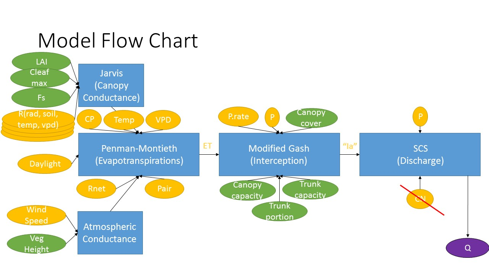

# Model package objective:


__This functions package objective is to calculate the "intial abstraction" (I) paramter of the SCS method, based on pysical ecoh-hydraulic parameters (rather than the estimation with Curve Number (CN) in the original method.__


This R markdown paper and package include the following models:

1. Atmospheric conductance model

2. canopy conductance model

3. Penman-Montieth model

4. Interception model

5. SCS method model

The model flow chart is, in general:


__General gross-assumptions for the model:__

1. Evaporation in the interception model is the evapotranspiration of penman-montieth model.

2. Initial abstraction of the SCS is the interception model output (not including other abstraction other then the trees).

3. At the beginning of each day the initial abstraction (or interception) is emptied.

For further explanation, Please see the paper "Eco-hydrologic modeling  Final Project- Elad Dente" included in this folder.


## The canopy conductance function, including Jarvis model parameters and LAI

Canopy conductance (Kc; mm/s)= (Jarvis model output (Jarvis_c) * maximum stomatal conuctance (Cleaf_max) * LAI * Shelter factor.
The R in Jarvis parameters is for "relative". the values can be taken from the plots and equations in "Physical Hydrology: Third Edition" by S. Lawrence Dingman (p. 282).
Default values were set by the Goren example (see below).
The Kc values can be used in Penman-Montieth model (see below).

```{r, echo=FALSE}
library(ggplot2)
```
The Canopy Conductance Model code:
```{r}
#' Canopy Conductance Model
#' 
#' The R in Jarvis parameters is for "relative". the valus can be taken from the plots and equations in "Physical Hydrology: Third Edition" by S. Lawrence Dingman (p. 282).
#Default values for Quercus ilex (oaks) and Mediterranian sclerophyllous where taken from
#Schulze, E. D., Kelliher, F. M., Korner, C., Lloyd, J., & Leuning, R. (1994). Relationships among maximum stomatal #conductance, ecosystem surface conductance, carbon assimilation rate, and plant nitrogen nutrition: a global ecology #scaling exercise. Annual Review of Ecology and Systematics, 629-660.
#and
#Limousin, J. M., Rambal, S., Ourcival, J. M., & Joffre, R. (2008). Modelling rainfall interception in a Mediterranean #Quercus ilex ecosystem: lesson from a throughfall exclusion experiment. Journal of Hydrology, 357(1), 57-66. 


#' @param T (deg c) air temperature at measured height above ground (0>T<40 deg C).
#' @param Cleaf_max (mm/s) maximum stomatal contuctance .
#' @param Rnrad (-) Relative solar radiation.
#' @param Rvpd (-) Relative absolute-humidity deficit.
#' @param Rteta (-) Relative soli moisture deficit.
#' @param LAI (-) Leaf area index.
#' @param Fs (-) Shelter factor.
#' @usage calculate canopy conductance, based on the Jarvis model. To be used in Penman-Montieth ET model.
#' @author Elad Dente
#' @return Jarvis model coefficient (Jarvis_c) and canopy conductance (Kc, mm/s)

canopy_conductance<-
  function(Cleaf_max=4.8, Rnrad, Rvpd=0.85,T, Rteta, LAI=1.61,Fs=0.2) {
    
    #       Internal Variables
    #       RT  (-) from  T, based on Stewart (1988) relationsip). 
    
    #RT from T
    RT=(T*(40-T)^1.18)/691
    
    #claculating Jc
    Jarvis_c = (Cleaf_max*Rnrad*Rvpd*RT*Rteta)
    
    #claculating Kc
    Kc = (Jarvis_c*LAI*Fs)
    
    #return Kc
    return(list(Jarvis_coefficient=Jarvis_c, Relative_temperature=RT, Canopy_conductance_mm.s=Kc))
  }
```

### Example of sensitivity analysis (Canopy conductance Vs. Temperature)
```{r}
#typical T values:
T_i=c(1,5,10,15,20,25,30,35,39);
#Calculating Kc for differnt T_i values:
Kc_res=matrix(,nrow = length(T_i), ncol = 1);
for (i in 1:length(T_i)){
    a<-(canopy_conductance(Rnrad=0.5, T = T_i[i],Rteta=1,Fs=0.6,LAI=1,Cleaf_max = 4));
    Kc_res[i,1]=a$Canopy_conductance_mm.s
  }

```

#### Kc Vs. T plot
```{r echo=FALSE}
qplot(T_i,Kc_res,main="canopy conductance VS Temperature", xlab="T (deg C)", ylab="Kc (mm/s)") + geom_line(colour="red", linetype="dashed", size=1) + geom_point(colour="blue", size=4, shape=21, fill="white")
```

As expected according to the linearity of the Jarvis model, The relation looks similar to the temperature-relative temperature plot.


## Atmospheric conductance model
Based on eq.6.48 (p. 278) in "Physical Hydrology: Third Edition" by S. Lawrence Dingman
This model gives estimation of the atmospheric conductance (Ca) based on the 
wind velocity (at 2m above vegetation, 'windspeed') and vegetation height ('z_veg').

The code:
```{r}
#' Atmospheric conductance model
#' 
#' Based on eq.6.48 (p. 278) in "Physical Hydrology: Third Edition" by S. Lawrence Dingman
#' This model gives estimation of the atmospheric conductance (Ca) based on the 
#' wind velocity (at 2m above vegetation, 'windspeed') and vegetation height ('z_veg')
#' 
#' @param   windspeed (cm/s) at 2m above ground 
#' @param   z_veg (cm), height of vegetation above ground
#' @usage calculate atmospheric conductance to be used in Penman-Montieth ET model.
#' @author Elad Dente
#' @return zd, z0, zm (all in cm), and atmospheric conductance (cm/s)

atmo_conductance <-
function(windspeed, z_veg) {
    #       Internal Variables
    #
    #       Zd     (cm)    zero-plan displacement height
    #       z0    (cm)     roughness height
    #       zm      (cm)      measurement_height
    
    #zd from Z_veg
    zd = 0.7*z_veg
    
    #z0 from z_veg
    z0 = 0.1*z_veg
    
    #zm from z_veg
    zm = (z_veg +200)
     
    #claculating Ca
    Ca = (windspeed/(6.25*(log((zm-zd)/z0))^2))
    
    #return Ca
    return(list(displacement_height=zd, roughness_height=z0, measurement_height=zm, atmospheric_conductance_cm.s=Ca))
  }

```

### Sensitivity analysis
Plot of Ca (atmospheric conductance) Vs. U (wind speed at 2m above canopy) and Z_veg (vegetation height):
```{r}
#windspeed values cm/s:
u=seq(10,1000);
#vegetation height values cm
z=c(10,20,50,100,200,500,1000,2000);
#matrix for the results
atmo_res=matrix(,nrow = length(u), ncol = length(z));
for (i in 1:length(u)){
  for (j in 1:length(z)){
    x<-(atmo_conductance(u[i],z[j]));
    atmo_res[i,j]=x$atmospheric_conductance_cm.s
  }
}

#ploting the matrix
matplot(atmo_res, type = c("b"),pch=1,col = 1:8,
        main="Ca vs wind speed and vegetation height", xlab="u (cm/s)", ylab="Ca (cm/s)",
  xlim=c(10, 1000), ylim=c(0.01, 100),log="xy")
legend("bottomright", legend = z[1:8], col=1:8, pch=1, title="Height(cm)")
```

It looks quiet similar to the same plot from literature.


## Penman-montieth model
This model authored by Naomi Tague and edited by me (Elad Dente)
It uses the output of the canopy conductance and atmospheric conductance models.
_Be aware to change units of the atmospheric conductance (cm to mm)._
day time was set to be 11 hours as default (Israeli winter) 
```{r}
#' Penman Montieth Equation
#' 
#' THis function computer evapotranspiration based on radiation, conductance etc
#' 

#' @param        Tair    (deg C) air temperature
#' @param    vpd     (Pa)    vapour pressure deficit
#' @param     Rnet    (j/m2/day)      net radiation
#' @param     gs      (mm/s)  surface conductance
#' @param     ga      (mm/s)  aerodynamic conductance
#' @param     CP  =      1010.0 (J/kg*K) specific heat of air
#' @param    Pair = 101325 (Pa)
#' @author Naomi (edited by Elad Dente)
#' @return ET (W/m^2),Evapotranspiration (m/s), Evapotranspiration (mm/day)
 
 
penman_montieth =
function(Tair, vpd, Rnet, gs,ga, dayl=11, CP=1010, Pair=101325) {
  
  #       Internal Variables
  #
  #       rho     (kg/m3)         density of air
  #       CP      (K/jg/degC)     specific heat of air
  #       lhvap   (J/kg)          latent heat of vapourization H20
  #       s       (Pa/degC)       slope of sat vpd vs T curve
  #       rs      (s/m)   surface resistance
  #       ra      (s/m)   aerodynamic resistance
  

  # convert Rnet to daytime value in j/m2/s
  Rnet = Rnet / (60*60*dayl)
  
  # convert conductance to resistance and change units
  rs = 1000.0/gs
  ra = 1000.0/ga
  
  # Assign tk (Kelvins)
  tk = Tair + 273.15
  
  #       Density of air (rho) as a fn. of air temp.
  rho = 1.292 * ( 0.00428 * Tair )
  
  #       Latent heat of vapourization as a fn. of Tair.
  lhvap = 2.5023e6 - 2430.54 * Tair
  
  #       Temperature offsets for slope estimates
  dt = 0.2
  t1 = Tair + dt
  t2 = Tair - dt
  
  #       Saturation vapour pressures at t1 and t2(Pa)
  pvs1 = 610.7 * exp(17.38 * t1 / ( 239.0 + t1))
  pvs2 = 610.7 * exp(17.38 * t2 / ( 239.0 + t2))
  
  #       Slope of pvs vs T curve at Tair (Pa/deg C)
  s = ( pvs1 -   pvs2 ) / ( t1 -  t2 )
  
  #       Calculate gamma
  gamma = CP * Pair / ( lhvap )
  
  
  #       Evaporation in W/m2
  et = ((s*Rnet) + (rho*CP*vpd/ra)) / (gamma*(1.0 + rs/ra) +s)
  
  
  #       mH20/s = W/m2 * 1kgH20/lhvap J * 1m3H20/1000kGH20
  ewater = ( et/ ( lhvap * 1000 ))
  
  # mmH20/day
  ewater.day = ewater * dayl*60*60 * 1000
  
  # return from your function
  return(list(Evapotransiration=et,mH2O.s=ewater,mmH2O.day=ewater.day))
}

```

### Sensitivity analysis:
Test of the sensitivity of the model to temperature, as it changes the Tair and gs (canopy conductance model output) parameters on top of the direct Penman-Montieth input parameters.
```{r}
#Calculating ET for differnt T_i values:
ET_res=matrix(,nrow = length(T_i), ncol = 1);
for (i in 1:length(T_i))
  {
    b<-penman_montieth(Tair=T_i[i],vpd=250,Rnet=9000000, gs=Kc_res[i],ga=1)
    ET_res[i,1]=b$mmH2O.day
}
#plot
qplot(T_i,ET_res,main="Evapotranspiration VS Temperature", xlab="T (deg C)", ylab="ET (mm/day)")+ geom_line() + geom_point(colour="blue", size=4, shape=21, fill="white")
```

It seems like the Kc takes the ET down above 35 deg c.


## Interception model
This model calculates interception, based on Gash et al. 1995, and Valente et al. 1977.
It is based on the conceptual logic of Gash an Rutter model: rain is filling the canopy storage, and then the trunk storage. The total interception for one day is the trunk plus the canopy interception. If the daily rain is not filling the total tree storage, the output will be the daily rain value. An important assumption is that at the beginning of each day the initial abstraction (or interception) is emptied (in contrast with the classic model).
The defaults represent values of Mediterranean Quercus ilex (evergreen oak) ecosystem according to the reference below.
```{r}
#' Canopy and Stem Interception Model
#' 
#' This model calculates the precipitation necessery to fill canopy and stem storage, based on Gash et al. 1995, and Valente et al. 1977.
#' The defults represent values of Mediterranean Quercus ilex (evergreen oak) ecosystem acording to the reference below.
#'
#' @usage calculate Interception for a day
#' @param P.rate (mm/hr) is the mean precipitation rate.
#' @param  Evap (mm) total evporation (Here we try to aplly the Penman-montieth ET.)
#' @param P (mm) total precipitation
#' @param c (-) canopy cover per unit area
#' @param S (mm) canopy storage capacity  
#' @param St (mm) trunks storage capacity
#' @param Pt (-) the propotion of rain goes to stemflow
#' @author Elad Dente
#' @return P.canopy (mm) canopy interception, P.stem (mm) stem interception, tot_inter (mm) total interception, and prc.inter (%) precentage of interception in precipitation. .
#' @references 
#Valente, F., David, J. S., & Gash, J. H. C. (1997). Modelling interception loss for two sparse eucalypt and pine forests in central Portugal using reformulated Rutter and Gash analytical models. Journal of Hydrology, 190(1), 141-162.
#Limousin, J. M., Rambal, S., Ourcival, J. M., & Joffre, R. (2008). Modelling rainfall interception in a Mediterranean Quercus ilex ecosystem: lesson from a throughfall exclusion experiment. Journal of Hydrology, 357(1), 57-66.

interception<-
  function(P.rate,Evap,P,c=0.59,S=1.7,St=0.64,Pt=0.1,dayl=11){
  
  #       Internal Variables
  #       Ec (mm/hr) is the mean evaporation rate. 
  #       Sc (mm) canopy storage capcity per cover unit (S/c)
  #       Stc (mm) stem storage capcity per cover unit (St/c)
  #       Ptc (mm) propotion of rain goes to stems per cover unit (Pt/c)
  
  #calculating mean ET rate (mm/hr)
  Ec= Evap/dayl
  #calculating Sc
  Sc= S/c
  #calculating Stc
  Stc= St/c
  #calculating Ptc
  Ptc= Pt/c
  
  #calculating P.canopy
  P.canopy=-(P.rate/Ec)*Sc*log(1-(Ec/P.rate))
  P.stem=ifelse(P.canopy < P,(P.rate/(P.rate-Ec))*(Stc/Ptc),0)
  #calculating P.stem
  #P.stem=(P.rate/(P.rate-Ec))*(Stc/Ptc)+P.canopy
  
  #total interception
  tot_inter=ifelse((P.canopy+P.stem)<P,(P.canopy+P.stem),P)
  
  # % total interception from precipitation
  prc.inter=100*tot_inter/P
  
 # tot_inter_Ia=ifelse((tot_inter > P), P, tot_inter)
  
  return (list(canopy_interception=P.canopy,stem_interception=P.stem,total_interception=tot_inter,inter.precentage=prc.inter))
}
```
###Sensitivity analysis:
Test of the influence of evapotranspiration on the interception/rain ratio, and the total interception with the partial canopy and stem interception.
```{r}
#Calculating total interception for differnt rain intensity values:
Evap_i=seq(0.1,10.1,1)
interception_res=matrix(0,nrow = length(Evap_i), ncol = 6,dimnames = list(c(),c("canopy","stem","total","presentage","ratio","Ia")));

for (i in 1:length(Evap_i))
  {
    d=interception(P.rate=1.3,Evap=Evap_i[i],P=25,c=0.59,S=2.6,St=0.064,Pt=0.1,dayl=11)
    interception_res[i,1]=d[[1]]
    interception_res[i,2]=d[[2]]
    interception_res[i,3]=d[[3]]
    interception_res[i,4]=d[[4]]
    
}
#plot of %interception
qplot(Evap_i,interception_res[,4],main="Interception (as % from daily rain) VS Evapotranspiration", xlab="Evapotranspiration (mm/day)", ylab="Interception (%)") + geom_line()
#plot of stem, canopy and total interception
plot(Evap_i,interception_res[,3],main="P.Interception VS Evapotranspiration", xlab="Evapotranspiration (mm/day)", ylab="Interception (mm/day)", ylim=c(0,max(interception_res[,3])),type=c("b"))
lines(interception_res[,1],col="green",lwd=2)
lines(interception_res[,2],col="brown",lwd=2)
legend("topleft",legend=c("Total","Canopy","Stem"),col=c("black","green","brown"),pch=1)
```

The positive relation between interception (total, canopy and stem) and evaporation. Under this parameters set, interception/rain ranges from 20 to 40% (for extreme ET value of 10mm/day)!

##SCS method
This function calculate the SCS method for Runoff, in attempt to use physical parameters rather the curve number of the original method.
Here the usage is for estimation of daily runoff.
```{r}
#' SCS Model
#' 
#' This function calculate the SCS method for Runoff, in atempt to use physical parameters rather the curve number of #' the original method.
#' Here the usage is for estimation of daily runoff
#' 
#'@param P (mm) daily rain.
#'@param I (mm) daily initial abstraction (we try to use the daily interception from the interception model)
#'@author Elad Dente
#'@references http://www.professorpatel.com/uploads/7/6/5/6/7656897/tr55.pdf
#'@return I, S, CN and Q (all in mm)

SCS=function(P,I){
  S=I/0.2
  Q=((P-I)*(P-I))/(P-I+S)
  
  #IS is the I acording to I=0.2*S
  IS=0.2*S
  #CN number for SI units
  CN=25400/(S+254)
  #results
  return(list(IS=IS,I=I,runoff=Q,CN=CN))
}
  
```

###Sensitivity analysis:
Test of the influence of Initial abstraction (interception model output).
```{r}
#Calculating total interception for differnt rain intensity values:

SCS_res=matrix(,nrow = length(Evap_i), ncol = 1)
for (i in 1:length(Evap_i))
  {
    e<-SCS(P=90,I=interception_res[i,3])
    SCS_res[i,1]=e$runoff
}
#plot
qplot(interception_res[,3],SCS_res,main="Runoff VS Interception", xlab="Interception (mm/day)", ylab="Runoff (mm/day)")+ geom_line(colour="blue", linetype=1, size=2) + geom_point(colour="blue", size=4, shape=3, fill="black")

```

The interception cutting from the runoff, but only ~23% in this example.

#Example from Goren Park Area (North-West Israel)
In this area the vegetation characterized with Mediterranean shrubs and Evergreen Oaks (~3 meters height)
The meteorologic data were acquired from the Israeli Meteorological Survey and MOP-TZAFON institute
https://ims.data.gov.il/
Eilon Station
http://www.mop-zafon.net/
Goren Station
35.24, 33.047
The example Below is from February 2015.
The data-set file is "Eilon_dataset.csv".
```{r}
#reading the dataset
Goren = read.csv("Datasets/Eilon_dataset.csv", sep=",", header=T)
Goren_results=matrix(0,nrow=28,ncol=4)
#calculating for the dataset and parameters that charcterizng the vegetation
for (i in 1:28)
{
Goren_results[i,1]=  penman_montieth(Tair=Goren$Goren.daytemp..degc.[i], vpd=Goren$Goren_day.VPD..Pa.[i], Rnet=Goren$Goren_dayNrad.J.m2.day.[i],gs=canopy_conductance(Cleaf_max=4.8, Rnrad=Goren$Rnrad[i], Rvpd=0.85,T=Goren$Goren.daytemp..degc.[i], Rteta=0.45, LAI=1.61)[[3]] ,ga=10*(atmo_conductance(Goren$Goren_windspeed[i],300)[[4]]))[[3]]
Goren_results[i,2]=interception(P.rate=Goren$Goren.mean.rainRate[i],Evap=Goren_results[i,1],P=Goren$Goren_rain[i],c=0.59,S=2.6,St=0.064,Pt=0.1,dayl=11)[[3]] 
Goren_results[i,3]=SCS(P=Goren$Goren_rain[i],I=Goren_results[i,2])[[3]]
Goren_results[i,4]=Goren$Goren_rain[i]
 }
  
# plot of the results
matplot(Goren_results[,1:4], type = c("b"),pch=1,col = 1:4,
main="Interception, Runoff, Rain and ET for day", xlab="day", ylab="mm")
legend("topleft", legend = c("ET","Interception", "Q","Rain"), col=1:4, pch=1)

```


#Parameter uncertainty analysis using GLUE

```{r}
#parameters that their whight will be tested:
#LAI
#Cleaf_max
#Fs, Range
#Z_veg
#all of them are paramters that relate to the vegetation.

#building 600 sets of parameters using random numbers:
stats=array(0,dim=c(600,5),dimnames=list(seq(1:600),c("row","LAI","Cleaf_max","Fs","Z_veg")))
stats[,1]=seq(1:600)
stats[,2]=rnorm(600, mean=3, sd=1)
stats[,3]=rnorm(600, mean=4.8, sd=0.5)
stats[,4]=runif(600, min=0.1, max=0.3)
stats[,5]=rnorm(600, mean=300, sd=50)
stats=as.data.frame.array(stats)

#Building the modeled ET array
ModET=array(0,dim=c(28,600))
#reading data
Goren = read.csv("Datasets/Eilon_dataset.csv", sep=",", header=T)

#loop for calculating model for parmeters sets and measured atmospheric values for Goren Park.
for (i in 1:28)
  {
  for(j in 1:600)
    {
    ModET[i,j]=penman_montieth(Tair=Goren$Goren.daytemp..degc.[i], vpd=Goren$Goren_day.VPD..Pa.[i], Rnet=Goren$Goren_dayNrad.J.m2.day.[i],                   gs=canopy_conductance(Cleaf_max=stats$Cleaf_max[j], Rnrad=Goren$Rnrad[i], Rvpd=0.85,T=Goren$Goren.daytemp..degc.[i], Rteta=Goren$Rteta[i], LAI=stats$LAI[j])[[3]]                   ,ga=10*(atmo_conductance(Goren$Goren_windspeed[i],stats$Z_veg[j])[[4]]))[[3]]
     }
}


#addin the observed ET from Goren
Goren$Goren_totET=Goren$Goren.dayEP_aero..mm.+Goren$Goren.dayEP_rad..mm.
AeroET_obs=Goren$Goren_totET
both=cbind(ModET,AeroET_obs)
both=as.data.frame(both)
AeroET_obs=as.data.frame(AeroET_obs)
ModET=as.data.frame(ModET)

# Correlation coefficient
p.corr = apply(ModET, 2, cor, y=AeroET_obs)

# histogram
hist(p.corr, main="Histogram of Correlation", xlab="Correlation")
stats$correl=p.corr

#NSE for the results
#' NSE
#' 
#' Nash-Sutcliffe Efficiency Performance Metric
#' @param m modelled value (any unit)
#' @param o observed value (any unit) 
#' @return nse  
NSE = function (m, o)        
{
    err = m-o
    meanobs = mean(o)
    mse = sum(err*err)
    ovar = sum((o-meanobs)*(o-meanobs))
    nse = 1.0 - mse/ovar
    nse
}
NSE_res = apply(ModET, 2, NSE, o=AeroET_obs[1:28,1])
stats$NSE = NSE_res
logNSE = apply(log(ModET),2, NSE, o=log(AeroET_obs[1:28,1]))
stats$logNSE = logNSE
hist(stats$logNSE)

#RMSD
RMSD=function(mm,oo)
{
  Rres=((sum((mm-oo)*(mm-oo)))/28)*0.5
  return(Rres)
}
rmsd_res = apply(ModET, 2, RMSD, oo=AeroET_obs[1:28,1])
stats$RMSD = rmsd_res
hist(stats$RMSD)

#err
err=(apply(ModET,2,mean)-mean(AeroET_obs[1:28,1]))/mean(AeroET_obs[1:28,1])
stats$err=err*100
hist(stats$err)

# plot p.correl vs NSE
plot(stats$NSE, stats$correl, ylab="Correlation", xlab="NSE", ylim=c(0,1))
plot(stats$NSE, stats$correl, ylab="Correlation", xlab="NSE", ylim=c(0,1),xlim=c(0,1))

# prepering GLUE vectors
#Accuarcy
stats$accuracy=pmax(0.0,stats$NSE)*pmax(0.0, stats$logNSE)*pmax(0.0,(1-abs(stats$err/100)))#*pmax(0,1.7-stats$RMSD))
summary(stats$accuracy)
hist(stats$accuracy, main="Accuracy")

#Threshold
# top N
topN = 50
top<-stats[order(stats$accuracy,decreasing=T),]
stats.acc=top[1:topN,]

#GLUE
# weight for each parameter set
max_acc=max(stats.acc$accuracy)
min_acc=min(stats.acc$accuracy)
stats.acc$w_acc=(stats.acc$accuracy-min_acc)/(max_acc-min_acc)
sum_acc=sum(stats.acc$accuracy)
stats.acc$wt_acc=stats.acc$accuracy/sum_acc

Nacc = nrow(stats.acc)

# generate ET as weighted average of all acceptable parameter sets
accept.cols = stats.acc$row
accept.wts = stats.acc$wt_acc
aver.ET = apply(ModET[,accept.cols],1, weighted.mean, accept.wts)

# calculate upper and lower confidence bounds 95%
library(Hmisc)
glue.res=apply(ModET[,accept.cols],1,"wtd.quantile",weights=accept.wts,prob=c(0.05,0.975),normwt=T)
glue.res=as.data.frame(t(glue.res))
colnames(glue.res)=c("low","high")

# plotting ET for all acceptable parameter sets
stck = stack(ModET[,accept.cols])
maxET = max(stck$values)
minET = min(stck$values)
plot(aver.ET,type="l",lwd=1, lty=2, xlab="Time(days)",ylab=" ET (mm/day)",main="GLUE", ylim=c(minET,maxET))

x<-1:nrow(glue.res)
polygon(c(x,rev(x)),c(glue.res$low,rev(glue.res$high)),col="pink",border=NA)
lines(AeroET_obs,col="red",lwd=2)
lines(Goren_results[,1],col="green",lwd=2)
lines(aver.ET,lwd=2)
legend("topright", legend=c("95% confidence limit","weighted mean", "observation","Guessed Parameters"), col=c("pink","black","red","green"), lty=c(1,1,1,1), lwd=c(4,3,2,2))
```

The correlation is pretty good (~0.8).
Some NSE values are above 0 (they explain the results better than the mean), but none of them is above 0.6.
The GLUE analysis (relatively narrow 95% confidence limit, pink) can suggest that the model is not so influenced by the tested parameters. The observed ET values are almost completely out of the confidence limit bounds, which may suggest on weakness of the model.    


